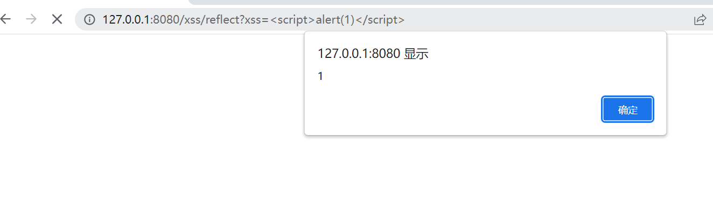
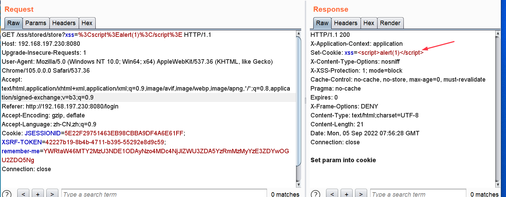
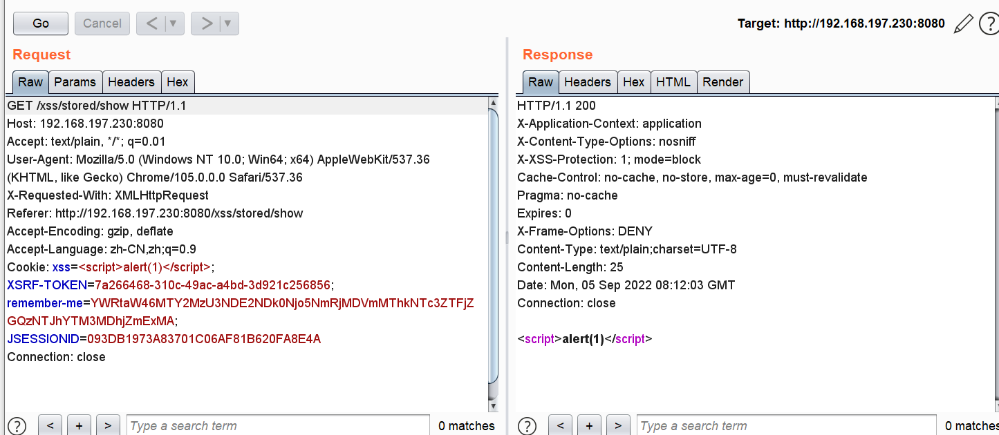

# XSS

## 反射形XSS

反射型 XSS，是指应用程序将用户发送的不可信赖数据在未经过 滤、转义的情况下，直接输出到了页面，致使其中包含的恶意 JavaScript 代码被执行。

```java
@RequestMapping("/reflect") //网页请求
@ResponseBody  //返回内容到网页
public static String reflect(String xss) {//请求参数为reflect
    return xss;
}
```



payload

```html
http://localhost:8080/xss/reflect?xss=<script>alert(1)</script>
```

## 存储型XSS

存储型 XSS，是指应用程序将用户发送的不可信赖数据在未经过 滤、转义的情况下，将其存入数据库中，后面应用程序从数据库中获取到该数据并在未经过 滤、转义的情况下输出到页面时，数据中包含的恶意 JavaScript 代码将会被执行。

1.将js恶意代码传到cookie中

```java
@Controller
@RequestMapping("/xss")
public class XSS {
@RequestMapping("/stored/store")
@ResponseBody
public String store(String xss, HttpServletResponse response) {
    Cookie cookie = new Cookie("xss", xss);//生成一个cookie，命名xss
    response.addCookie(cookie);//添加cookie到服务器端
    return "Set param into cookie";
}
}
```



```java
@Controller
@RequestMapping("/xss")
public class XSS {
@RequestMapping("/stored/show")
@ResponseBody
public String show(@CookieValue("xss") String xss) {//获取cookie为xss的值，并返回
    return xss;
}
}
```



## 修复

```java
@Controller
@RequestMapping("/xss")
public class XSS {
@RequestMapping("/safe")
@ResponseBody
public static String safe(String xss) {
    return encode(xss);//将传的数据编码后返回
}

private static String encode(String origin) {
    origin = StringUtils.replace(origin, "&", "&amp;");
    origin = StringUtils.replace(origin, "<", "&lt;");
    origin = StringUtils.replace(origin, ">", "&gt;");
    origin = StringUtils.replace(origin, "\"", "&quot;");
    origin = StringUtils.replace(origin, "'", "&#x27;");
    origin = StringUtils.replace(origin, "/", "&#x2F;");
    return origin;
}
}
```

1. 对客户端输入数据（包括但不限于 GET 和 POST 请求数据、HTTP 请求头数据等）进 行严格校验： 

   （1） 通过正则校验限制输入数据中可接受的字符集合（如针对用户提交的个人信息， 可限制用户名只能包含数字和字母、限制性别值只能为‘0’或‘1’等）。 （2） 输入数据为数字型参数时，必须进行强制类型转换来校验数据的合法性。 

   （3） 限制输入数据的长度，来加大攻击者的攻击难度。 

   （4） 对输入数据中包含的如下恶意字符进行过滤： new String[]{"<", ">", "'", "\"", "(", ")", "\\", "&", ":", "`"}; 

2.  对输入数据进行集中验证，防止因多个入口的验证方法导致漏验或绕过问题。可通过重写 `javax.servlet.http.HttpServletRequestWrapper` 类的 `getParameterValues()`方法、 `getParameter(`)方法和 `getHeader()`方法来实现对输入数据的全局处理。 

3. 输入数据的安全性不能依赖于客户端验证，必须在服务端对其进行最终验证。（客 户端的验证只能作为辅助手段用于减少客户端和服务端的信息交互次数）

4.  将不可信数据输出到页面之前，必须进行编码处理：

   （1） 在 jsp 页面中避免直接使用 EL 表达式输出数据，可使用如下 JSTL 标签库的 标签，该标签的 escapeXml 属性值默认为 true，会对数据进行 html 编码和 JavaScript 编码： 

   （2） 在使用 Struts2 框架时，可使用 struts 标签库的标签输出数据，由于 该标签默认情况只会进行 html 编码，不会进行 JavaScript 编码，所以建议显示声明 escapeXml 属性值为 true：

   （3） SSM 项目或 SpringBoot 项目中，在使用 thymeleaf 模板引擎时，建议使用 th:text 标签替换 th:utext，使用[[]]标签替换[()]标签，因为 th:text 与[[]]标签均会对输出数据进行 html 编码和 JavaScript 编码。 

   （4） 在不使用上述标签向页面输出数据时，可选择 Srping 框架提供的如下两个方法 中的任意一个对输出数据进行编码处理： org.springframework.web.util.JavaScriptUtils.javaScriptEscape();  org.springframework.web.util.HtmlUtils.htmlEscape();

5. 在重要的 Cookie 中加入 HttpOnly 来防止跨站脚本盗取 Cookie。 

6. 可结合具体业务场景搭配使用输入过滤和输出编码。

