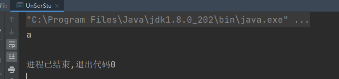

# Java反序列化原理


1.创建需要序列化的类，实现Serializable接口（只有实现序列化接口，才能利用序列化）

```java
package com;

import java.io.IOException;
import java.io.Serializable;

public class Student implements Serializable {//实现序列化接口
    private String name;
    private String sno;
    public Student(){

    }
    public Student(String name, String sno) {
        this.name = name;
        this.sno = sno;
    }

    public String getName() {
        return name;
    }

    public void setName(String name) {
        this.name = name;
    }

    public String getSno() {
        return sno;
    }

    public void setSno(String sno) {
        this.sno = sno;
    }

    @Override
    public String toString() {
        return "Student{" +
                "name='" + name + '\'' +
                ", sno='" + sno + '\'' +
                '}';
    }
}
```

2.创建序列化对象的类，将对象序列化到1.ser

```java
package com;

import java.io.*;

/**
 * 序列化Student类
 */
public class SerStu {
    public static void main(String[] args) {
        Student stu1 = new Student();
        stu1.setName("a");
        stu1.setSno("1");
        try {
            FileOutputStream fileOutputStream = new FileOutputStream("1.ser");//建立数据的输出通道,并写出文件为1.ser
            ObjectOutputStream objectOutputStream = new ObjectOutputStream(fileOutputStream);//将输出通道传给ObjectOutputStream
            objectOutputStream.writeObject(stu1);// 将对象写入输出流
            objectOutputStream.close();
            fileOutputStream.close();
            System.out.println("stu1对象已序列化到1.ser");
        } catch (IOException e) {
            throw new RuntimeException(e);
        }

    }

}
```

3.创建反序列化类

```java
package com;

import java.io.FileInputStream;
import java.io.ObjectInputStream;

/**
 * 反序列化stu
 */
public class UnSerStu {
    public static void main(String[] args) throws Exception {
        Student stu;
        FileInputStream fileInputStream = new FileInputStream("1.ser");
        ObjectInputStream objectInputStream = new ObjectInputStream(fileInputStream);
        stu =(Student) objectInputStream.readObject();
        System.out.println(stu.getName());
        objectInputStream.close();
        fileInputStream.close();

    }
}
```




```java
package com;

import java.io.*;

public class Demo2 {
    public static class Student implements Serializable {
        private String name;

        public Student(String name) {
            this.name = name;
        }

        private void readObject(java.io.ObjectInputStream objectInput) throws IOException, ClassNotFoundException {
            objectInput.defaultReadObject();

            ProcessBuilder processBuilder = new ProcessBuilder("ipconfig", "/all");
            Process process = processBuilder.start();
            InputStream inputStream = process.getInputStream();
            //gbk转码
            BufferedReader bufferedReader = new BufferedReader(new InputStreamReader(inputStream, "gbk"));

            String rs;
            while ((rs= bufferedReader.readLine())!=null){
                System.out.println(rs);
            }

        }

    }
    public static void main(String[] args) {
        //序列化
        try {
            FileOutputStream fileOutputStream = new FileOutputStream("a.ser");
            ObjectOutputStream objectOutputStream = new ObjectOutputStream(fileOutputStream);
            objectOutputStream.writeObject(new Student("zxc"));
            objectOutputStream.close();
            fileOutputStream.close();
        } catch (IOException e) {
            throw new RuntimeException(e);
        }

        //反序列化
        try {
            ObjectInputStream objectInputStream = new ObjectInputStream(new FileInputStream("a.ser"));
            Student student = (Student) objectInputStream.readObject();
            System.out.println(student.name);


        } catch (IOException e) {
            throw new RuntimeException(e);
        } catch (ClassNotFoundException e) {
            throw new RuntimeException(e);
        }
    }
}
```